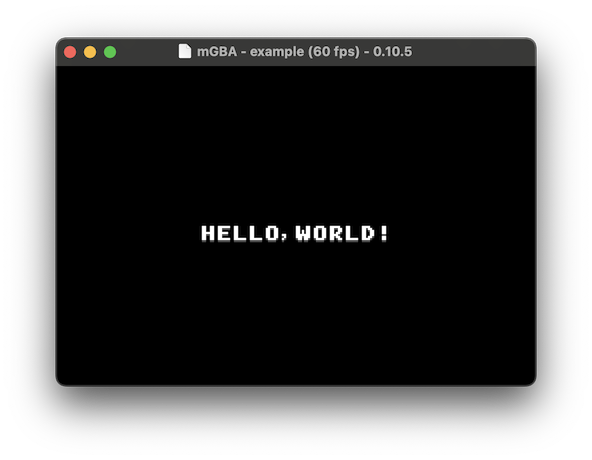

# GBA SDK for port from VGS-Zero

[VGS-Zero](https://github.com/suzukiplan/vgszero) から GBA へのゲームの移植に役立つライブラリとツールセットです。

## Feature

本SDKは、VGS-Zero用に開発されたゲームをGBAへ移植する用途に特化した仕様にしています。

- グラフィックスは mode0 の **16色/16パレット** のみ使用
- map (nametable) は BG0~3 の全面で 32x32 サイズに固定
- 音楽はGB/GBC互換音源のみを使用
- 効果音はPCM (2ch) を使用
- VGS-Zero のグラフィックスと効果音をほぼそのまま移行できるツールチェインを提供
- BGM は [Furnace Tracker](https://github.com/tildearrow/furnace) または [hUGETracker](https://github.com/SuperDisk/hUGETracker) での作成を推奨（GB/GBC互換音源の VGM を本SDKで利用できる .psg 形式に変換するツールチェインを提供）

VGS-Zero との仕様差

|比較項目|VGS-Zero|GBA (本SDK)|
|-:|:-:|:-:|
|画面解像度| 240x192 | 240x160 |
|BG面数| 2面(BG/FG) | 4面(BG0,1,2,3) |
|nametable| 32x32 | 32x32 |
|表示色| 16色/16パレット | 16色/16パレット |
|最大パターン数|65792 (VRAM+DPM)|1024|
|スプライト数|256|128|
|スプライトサイズ|8x8 ~ 128x128|8x8 ~ 64x64|
|BGM|VGS or NSF|DMG (GB/GBC)|
|SFX|PCM (44.1k, 16bits, mono)|PCM (16k, 8bits, mono)|
|SFX同時発音|256|2|

## How to use

### Libraries

1. [devkitPro](https://github.com/devkitPro/) でGBAのプロジェクトを作成
2. ソースコードディレクトリに [./src](./src) 以下のファイルをコピー
3. `#include "gbasdk.h"`

API 仕様はヘッダファイルの実装を確認してください。

[gbasdk.h](./src/gbasdk.h) は以下の機能別 API のヘッダファイルを `#include` しています。

|Header File|Function|
|:-----|:-------|
|[./src/vdp.h](./src/vdp.h)|映像処理装置 (VDP) 関連の API|
|[./src/psg.h](./src/psg.h)|BGM (GB互換音源) 関連の API|
|[./src/sfx.h](./src/sfx.h)|効果音 (PCM) 関連の API|
|[./src/joypad.h](./src/joypad.h)|ジョイパッド関連の API|
|[./src/vgs0.h](./src/vgs0.h)|乱数, 角度計算 (VGS-ZeroのHAGe相当) の API|

### Tools

- [./tools/bmp2pal/](./tools/bmp2pal/) ... 256色BitmapからGBA形式パレットを生成
- [./tools/bmp2chr/](./tools/bmp2chr/) ... 256色 or 16色BitmapからGBAの16/16形式
- [./tools/wav2pcm/](./tools/wav2pcm/) ... 44100Hz, 16bit, 1ch (VGS-Zero形式) の wav ファイルを GBA 形式（16384Hz, 8bit, 1ch）の RAW PCM データに変換
- [./tools/vgm2psg/](./tools/vgm2psg/) ... [Furnace Tracker](https://github.com/tildearrow/furnace) 等で出力した GB 音源用の VGM ファイルを BGM API が読めるデータ形式に変換

## TIPS

### GBA Wiki

GBAプログラミングの基本については以下のサイトが参考になります。

- https://akkera102.sakura.ne.jp/gbadev/ (日本語)
- https://problemkaputt.de/gbatek.htm (英語)

### vdp_wait_vblank

`vdp_wait_vblank` (V-BLANKの待機) は、単純に V-BLANK の待機（60fps同期）だけでなく次の処理を含んでいます。

1. BGM の再生
2. 効果音の再生
3. 仮想OAM を VRAM へコピー

音声の再生は、厳密な一定間隔での実行が必要になるため、B-BLANK の検出直後に実行する仕様にしています。

また、OAM (スプライト) の更新処理は基本的に WRAM 上で行い、V-BLANK のタイミングで一括して VRAM へ転送することでチラつきの発生を抑止しています。なお、BG については（VRAMサイズが大きいため）`vdp_` 関数で直接 VRAM の更新をしているため、`vdp_wait_vblank` 呼び出し後は BG を更新する処理を実行することが望ましいと考えられます。

### BG/Sprite Priority

描画優先順位は本SDKでは以下に固定しています。

1. BG3 (フェードアウト・フェードインなど)
2. BG2 (スコアやステータス表示など)
3. Sprite (キャラクタなど)
4. BG1 (マップ上のオブジェクトなど)
5. BG0 (マップなどの優先度が低い表示)

### Scale and Rotate Sprites

本SDKでは、スプライトの拡大縮小や回転機能について、通常のGBAプログラミングとは異なる独自設計の仕様に __制限__ しています。

通常のGBAプログラミングでは、ハードウェアアフィン変換の機能を駆使することで自由度の高い拡大縮小・回転などの変形ができますが、本SDKでは __22.5度単位の16方向の回転__、__15度単位の4方向の回転__、__0.5倍単位の4種類の拡大縮小（0.5, 1.0, 1.5, 2.0）__ のみ利用できる形になっています。

拡大縮小または回転を行いたいスプライトは、`vdp_oam_init` の引数2に `ON` を指定します。

```c
void vdp_oam_init(
    OAM* oam,   // target OAM
    int transform, // 0: disable, not0: enable
    int shape,  // type of size ... 0: 8x8,16x16,32x32,64x64 | 1: 16x8,32x8,32x16,64x32 | 2: 8x16,8x32,16x32,32x64
    int ptn,    // pattern index number (0-511)
    int size,   // pattern size (0-3)
    int palette // palette number (0-15)
);
```

そして、そのスプライトに対して `vdp_oam_scale` または `vdp_oam_rotate` で拡大縮小または回転をすることができます。

```c
/**
 * スプライトを回転
 * rotate:
 * - 0~15 = 0度~338度 (※約22.5度刻み)
 * - 16 = 15度, 17 = 30度, 18 = 330度, 19 = 345度
 *
 * Remarks:
 * - rotate に 20 以上 または 0 未満の値を設定するとバッファオーバライトするので注意
 * - 本関数を呼び出すスプライトは vdp_oam_init で transform に ON を設定する必要がある
 * - 画像によっては見切れる場合がある
 * - 確実に見切れないようにするには vdp_oam_double を ON に設定する必要がある
 */
inline void vdp_oam_rotate(OAM* oam, int rotate);

/**
 * スプライトを拡大 or 縮小
 * scale: 0 = 0.5倍, 1 = 1.0倍, 2 = 1.5倍, 3 = 2.0倍
 *
 * Remarks:
 * - scale に 4 以上 または 0 未満の値を設定するとバッファオーバライトするので注意
 * - 本関数を呼び出すスプライトは vdp_oam_init で transform に ON を設定する必要がある
 * - 2 (1.5倍) 以上で拡大表示と見切れが発生する
 * - 見切れを回避するには vdp_oam_double を ON に設定する必要がある
 */
inline void vdp_oam_scale(OAM* oam, int scale);
```

## Example

`Hello, World!` を表示する簡単な実装例を提供しています。

- ビルド環境の OS は macOS or Linux をサポートしています
- devkitPro で構築した開発環境での利用を想定しています
- example の実行には mgba が必要です
  - macOS: `brew install mgba`
  - Linux: `apt install mgba`

上記が整った環境で以下のコマンドを実行すれば ビルド & 実行 ができます。

```bash
git clone https://github.com/suzukiplan/gbasdk
cd gbasdk/example
make
```



- ジョイパッドの上下左右を押すことで HW スクロール機能を用いて `Hello, World!` を 8 方向に動かすことができます
- スタートボタンを押すことで効果音が鳴ります

詳細は [./example/src/example.c](./example/src/example.c) の実装をご確認ください。

## License

[MIT](LICENSE.txt)
